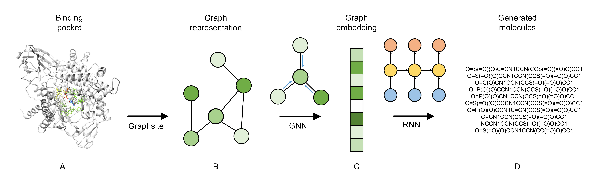

# Pocket2Drug
Pocket2Drug is an encoder-decoder deep neural network that predicts binding drugs given protein binding sites (pockets). The pocket graphs are generated using [Graphsite](https://github.com/shiwentao00/Graphsite). The encoder is a graph neural network, and the decoder is a recurrent neural network. The [SELFIES](https://github.com/aspuru-guzik-group/selfies) molecule representation is used as the tokenization scheme instead of SMILES. The pipeline of Pocket2Drug is illustrated below:
<p align="center">

</p>

## Usage
### Dependency
1. [Pytorch](https://pytorch.org/get-started/locally/)
2. [Pytorch-geometric](https://pytorch-geometric.readthedocs.io/en/latest/notes/installation.html)
3. [Rdkit](https://www.rdkit.org/docs/Install.html)
4. [SELFIES](https://github.com/aspuru-guzik-group/selfies)
5. Pandas 
6. [BioPandas](http://rasbt.github.io/biopandas/)
7. Numpy
8. Scipy

### Dataset
All the related data can be downloaded [here](). There are two dataset files:
1. dataset.tar.gz: contains all binding site data in this project.
2. pops.tar.gz: contains information of node feature contact surface area.

### Train
The configurations for training can be updated in ```train.yaml```. Modify the ```pocket_dir``` and ```pop_dir``` entries to the paths of the extracted dataset. Modify the ```out_dir``` entry to the folder where you want to save the output results. Then,
```
python train.py
```

### Inference
After training, the trained model will be saved at ```out_dir```, and we can use it to sample predicted molecules:
```
python sample.py -batch_size 1024 -num_batches 1 -pocket_dir path_to_dataset_folder -popsa_dir path_to_pops_folder
```